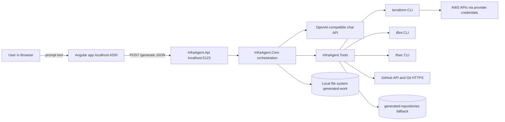
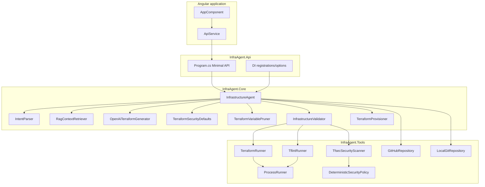
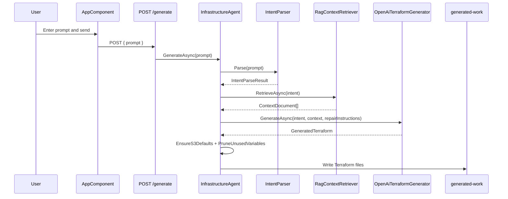
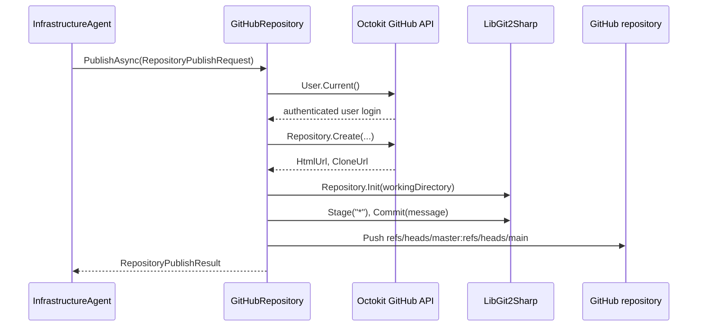
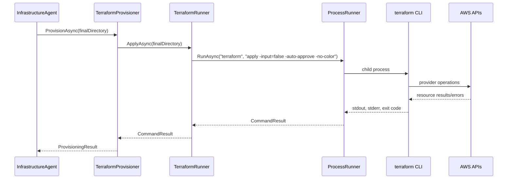
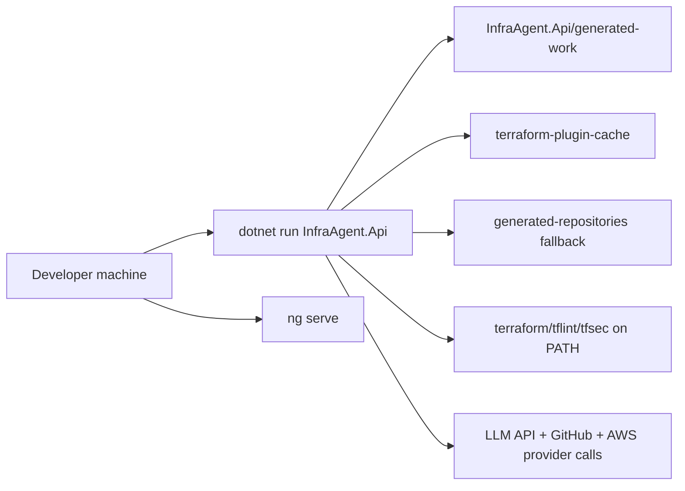
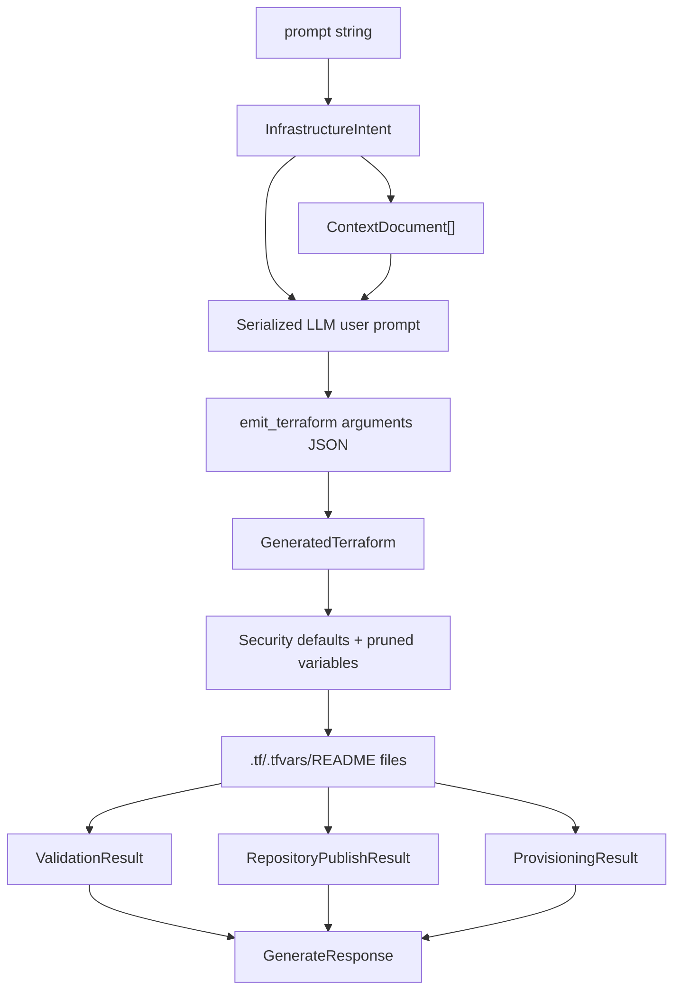
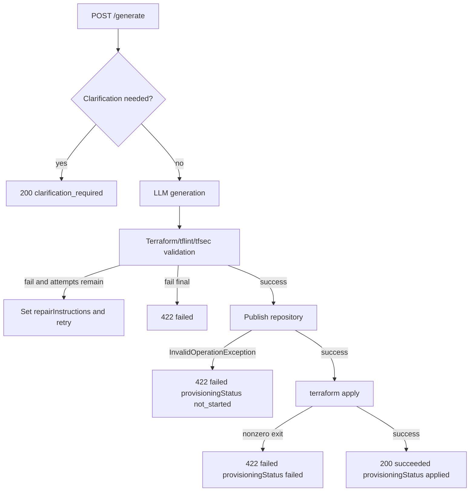

# InfraAgent Project Technical Handbook

This handbook documents the repository exactly as inspected on 2026-07-23. It is based on executable code, project files, configuration files with secret values redacted, tests, and documentation currently present in the repository. It does not describe a preferred future architecture as if it already exists.

Secret values are intentionally not shown. Configuration keys and environment-variable names are shown because they are required to understand the project.

## 1. Executive Project Summary

InfraAgent is a Natural-Language-to-Terraform application. A user enters an infrastructure request in an Angular UI or calls the ASP.NET Core API directly. The backend parses the prompt into a limited intent model, retrieves local markdown knowledge, asks an OpenAI-compatible chat API to emit Terraform project files, normalizes some Terraform safety defaults, validates the Terraform with local command-line tools, publishes the generated files to GitHub or a local Git repository, and then runs `terraform apply` from the backend process.

The intended user is a developer or cloud engineer who wants a small AWS S3 or EC2 Terraform project generated from a natural-language request. The implemented Phase 1 resource scope is AWS S3 buckets and EC2 instances only.

The main input is a JSON request body:

```json
{
  "prompt": "Create an encrypted S3 bucket for user uploads with versioning enabled"
}
```

The final API output is a `GenerateResponse` containing a status, optional clarification, repository URL, files created, summary, assumptions, error text, provisioning status, and Terraform output. See `InfraAgent.Core/Orchestration/GenerateResponse.cs`.

In this codebase, "natural language to Terraform" means:

1. `IntentParser.Parse` uses regex/string checks to create an `InfrastructureIntent`; it requires an explicit supported AWS region code and returns a clarification instead of falling back to a default region.
2. `RagContextRetriever.RetrieveAsync` selects local markdown knowledge chunks.
3. `OpenAiTerraformGenerator.GenerateAsync` sends the intent/context to an OpenAI-compatible chat API with a function tool named `emit_terraform`.
4. The tool-call JSON is parsed into `GeneratedTerraform`.
5. `TerraformSecurityDefaults` and `TerraformVariablePruner` clean common unsafe or invalid output.
6. The files are written to a local `generated-work/<timestamp>` folder.

GitHub is involved through `GitHubRepository`, which uses Octokit to create a repository and LibGit2Sharp to initialize, commit, and push the generated Terraform. If `Git:GitHubToken` is missing, `Program.cs` wires `LocalGitRepository`, which writes a local Git repository under `Git:LocalRepositoryRoot`.

Infrastructure creation is initiated inside the backend process by `TerraformProvisioner.ProvisionAsync`, which calls `ITerraformRunner.ApplyAsync`, which runs `terraform apply -input=false -auto-approve -no-color` through `ProcessRunner`.

Implemented capabilities:

- ASP.NET Core Minimal API with `GET /`, `POST /generate`, `GET /debug/repos`, and `GET /debug/readme`.
- Angular 18 frontend with a single chat-style root component.
- Intent parsing for S3 and EC2, including explicit AWS region validation and prompt sanity checks.
- LLM-backed Terraform generation using the `OpenAI` .NET SDK and tool/function calling.
- Local RAG-style markdown context retrieval.
- Terraform source writing with path traversal guard.
- Terraform formatting/init/validate and apply through local child processes.
- `tflint` lint execution.
- Deterministic and tfsec-based security scanning.
- GitHub repository creation and push with Octokit plus LibGit2Sharp.
- Local Git fallback when no GitHub token is configured.
- xUnit unit tests and one Terraform CLI integration test.

Partially implemented or absent:

- `TemplateTerraformGenerator` exists and is tested but is not wired into runtime fallback.
- `FileContextRetriever` exists but runtime DI wires `RagContextRetriever`.
- `ITerraformRunner.PlanAsync` exists, but validation explicitly skips plan and provisioning calls apply directly.
- Pull request creation is not implemented.
- Branch creation beyond pushing local `master` to remote `main` is not implemented.
- Terraform destroy is not implemented and should not run.
- Authentication, authorization, database persistence, queues, background jobs, status polling, CI/CD workflows, Docker, and remote Terraform state are not implemented.

Verified technology stack:

- Backend: .NET 8, ASP.NET Core Minimal API, Microsoft dependency injection/options/logging, Swashbuckle.
- Core generation: OpenAI .NET SDK `OpenAI` package, `OpenAI.Chat.ChatClient`.
- Git/GitHub: Octokit and LibGit2Sharp.
- Terraform tools: local `terraform`, `tflint`, and `tfsec` executables through `System.Diagnostics.Process`.
- Frontend: Angular 18 standalone component, FormsModule, HttpClient, RxJS.
- Tests: xUnit, Microsoft.NET.Test.Sdk, coverlet collector.

Thirty-second interview explanation:

InfraAgent is a .NET 8 and Angular application that turns a user's AWS S3 or EC2 request into Terraform. The API parses the prompt into a constrained intent, retrieves local markdown guidance, calls an OpenAI-compatible model with a structured function schema, writes Terraform files, validates them with Terraform, tflint, and tfsec, publishes the files to GitHub or a local Git repository, and then runs `terraform apply` from the backend process. The current implementation is synchronous and stores Terraform state locally under `generated-work`.

Two-minute interview explanation:

The project is split into `InfraAgent.Api`, `InfraAgent.Core`, `InfraAgent.Tools`, `InfraAgent.Tests`, and an Angular app under `src`. The API exposes `POST /generate`, maps configuration into options classes, and wires interfaces like `IIntentParser`, `ITerraformGenerator`, `IInfrastructureValidator`, `IGitRepository`, and `IInfrastructureProvisioner`. The orchestration class, `InfrastructureAgent`, is the main workflow. It parses natural language using `IntentParser`, retrieves local knowledge using `RagContextRetriever`, calls `OpenAiTerraformGenerator`, applies deterministic cleanup through `TerraformSecurityDefaults` and `TerraformVariablePruner`, writes files to a timestamped work directory, validates the code through Terraform CLI, tflint, and tfsec, retries up to `Agent:MaxRepairAttempts`, writes README and `.gitignore`, publishes to GitHub with Octokit/LibGit2Sharp or local Git, then provisions by running Terraform apply. The Angular frontend posts `{ prompt }` to `http://localhost:5123/generate` and renders the response. Important gaps are no auth, no queue, no persistent job table, no remote Terraform state, no destroy or rollback workflow, no CI/CD workflows, and no concurrency lock for simultaneous applies.

## 2. Feature Implementation Matrix

| Feature | Implementation status | Main files | Entry point | External dependency | Important limitations |
|---|---|---|---|---|---|
| Natural-language request intake | Implemented | `src/app/app.component.ts`, `InfraAgent.Api/Program.cs`, `GenerateRequest.cs` | UI `send()` or `POST /generate` | Browser, HTTP | No authentication or rate limit |
| Prompt validation / intent parsing | Implemented | `IntentParser.cs`, intent records | `InfrastructureAgent.GenerateAsync` | None | Regex/string based; only S3/EC2 |
| LLM call | Implemented and used | `OpenAiTerraformGenerator.cs` | DI `ITerraformGenerator` | OpenAI-compatible API | No retry/backoff/timeout config beyond cancellation |
| Structured response parsing | Implemented | `OpenAiTerraformGenerator.GenerateAsync` | Tool call `emit_terraform` | OpenAI SDK | Throws if no tool call or malformed JSON |
| Deterministic template generation | Implemented but not wired | `TemplateTerraformGenerator.cs` | Tests only | None | README says fallback exists, but runtime does not use it |
| Terraform file creation | Implemented | `InfrastructureAgent.WriteTerraformFilesAsync` | Generate workflow | File system | Blocks absolute paths and `..`, but not all malicious Terraform content |
| Terraform formatting | Implemented | `InfrastructureValidator.cs`, `TerraformRunner.cs` | Validation | `terraform` binary | Fails if command fails |
| Terraform initialization | Implemented | `TerraformRunner.InitAsync` | Validation | `terraform`, Terraform registry/cache | Uses `-backend=false`; local state only |
| Terraform validate | Implemented | `TerraformRunner.ValidateAsync` | Validation | `terraform` | Warnings may still appear in output |
| Terraform plan | Implemented but not used in runtime | `TerraformRunner.PlanAsync` | None in production flow | `terraform` | Validation logs "plan skipped" |
| Terraform apply | Implemented and used | `TerraformProvisioner.cs`, `TerraformRunner.cs` | After publish | AWS credentials in process environment/profile | Auto-approve; no plan file or approval |
| Terraform destroy | Not implemented | None | None | None | Explicitly absent |
| `tflint` | Implemented | `TflintRunner.cs`, `InfrastructureValidator.cs` | Validation | `tflint` binary | Missing binary fails validation |
| Security/policy checks | Implemented | `DeterministicSecurityPolicy.cs`, `TfsecSecurityScanner.cs` | Validation | `tfsec` binary | Regex based plus selected tfsec findings |
| GitHub repo creation | Implemented | `GitHubRepository.cs` | Publish step | Octokit, GitHub PAT | No PR, no existing repo reuse |
| Branch creation | Partially implemented | `GitHubRepository.cs` | Push step | LibGit2Sharp | Pushes local `master` to remote `main`; no feature branch workflow |
| Commit | Implemented | `GitHubRepository.cs`, `LocalGitRepository.cs` | Publish step | LibGit2Sharp | Fixed author identity |
| Push | Implemented | `GitHubRepository.cs` | Publish step | GitHub HTTPS remote | No retry; token can fail |
| Pull request creation | Not implemented | None | None | None | No PR API call |
| Status tracking | Partially implemented | `GenerateResponse.cs`, frontend `loading` | Single HTTP request | None | No persisted job ID/polling |
| Logs | Implemented partially | `ProcessRunner.cs`, `InfrastructureAgent.cs`, ASP.NET logging | Runtime | Console/log providers | No correlation ID or audit log |
| Frontend display | Implemented | `src/app/*` | Angular root component | Browser | Single page, no tests |
| Authentication | Not implemented | None | None | None | API is open |
| Audit trail | Not implemented | None | None | None | Only transient logs and Git commits |
| Tests | Implemented partially | `InfraAgent.Tests` | `dotnet test` | xUnit | No frontend/API E2E tests in repo |

## 3. Actual Architecture

### System context



Arrow payloads:

- User to Angular: raw prompt string entered in textarea.
- Angular to API: `GenerateRequest` JSON with `prompt`.
- API to Core: `string prompt` plus cancellation token.
- Core to LLM: chat messages with system prompt, serialized intent/context/repair instructions, and tool schema.
- Core/Tools to CLIs: command-line invocations in a generated working directory.
- Terraform to AWS: provider API calls using credentials available to Terraform.
- Tools to GitHub: Octokit repository creation plus LibGit2Sharp HTTPS push.

### Component/container diagram



### Request sequence: user input to generated Terraform



### GitHub push sequence



### Automatic resource creation sequence



### Deployment diagram



No Dockerfile, Kubernetes manifest, cloud deployment descriptor, or GitHub Actions workflow is present in tracked files.

### Data-flow diagram



### Failure-flow diagram



## 4. End-to-End Runtime Flow

Scenario: `Create an encrypted S3 bucket for user uploads with versioning enabled`.

1. UI input: `AppComponent.prompt` receives the text through `[(ngModel)]` in `src/app/app.component.html`.
2. UI submit: `AppComponent.send()` trims the prompt, appends a user `Message`, clears `prompt`, sets `loading = true`, and calls `ApiService.generate(text)`.
3. HTTP call: `ApiService.generate` posts to `${environment.apiUrl}/generate`; both production and development environments use `http://localhost:5123`.
4. API route: `Program.cs` maps `POST /generate` at lines 96-112. It binds JSON into `GenerateRequest`.
5. Orchestration: route handler calls `IInfrastructureAgent.GenerateAsync(request.Prompt, cancellationToken)`.
6. Intent parsing: `IntentParser.Parse` checks empty input, prompt length, unsupported control characters, credential-like text, destructive operations, unsupported providers/services, supported resources, public S3, required/valid AWS region, open CIDR, EC2 instance type, CIDR requirements, bucket name, and returns `IntentParseResult`.
7. Context retrieval: `RagContextRetriever.RetrieveAsync` loads markdown files from the configured knowledge directory, tokenizes the query, chunks markdown, scores chunks, and returns top documents.
8. LLM request: `OpenAiTerraformGenerator.GenerateAsync` builds a function tool schema requiring `files`, `summary`, and `assumptions`. It serializes the original request, intent, context, and optional repair instructions into the user message.
9. LLM response parsing: it requires a tool call named `emit_terraform`, parses `FunctionArguments`, and maps file objects to a dictionary keyed by path.
10. Deterministic cleanup: `TerraformSecurityDefaults.EnsureS3Defaults` adds or normalizes S3 encryption and public access block resources. `TerraformVariablePruner.PruneUnusedVariables` removes unused variable declarations and undeclared `.tfvars` assignments.
11. Working directory: `InfrastructureAgent.CreateWorkingDirectory` creates `Agent:WorkingRoot/<yyyyMMddHHmmssfff>`.
12. File write: `WriteTerraformFilesAsync` rejects absolute paths and paths containing `..`, creates parent folders, and writes each file.
13. Validation: `InfrastructureValidator.ValidateAsync` runs `terraform fmt`, `terraform init`, `terraform validate`, then runs `tflint` and `tfsec` concurrently. It returns `ValidationResult`.
14. Repair loop: if validation fails and attempts remain, the output is sent back as repair instructions. The same working directory is reused while `.terraform` and `.terraform.lock.hcl` are preserved.
15. Repository files: after validation succeeds, `WriteRepositoryFilesAsync` writes a generated README and `.gitignore`.
16. Publishing: `IGitRepository.PublishAsync` is either `GitHubRepository` or `LocalGitRepository` depending on `Git:GitHubToken`.
17. Provisioning: `TerraformProvisioner.ProvisionAsync` runs `terraform apply -input=false -auto-approve -no-color`.
18. API response: success returns HTTP 200 with `status = "succeeded"`. Most failures return HTTP 422 with `status = "failed"`, except clarification returns 200.
19. Frontend rendering: `AppComponent.toMessage` maps success to an assistant message with repository link, files, assumptions, provisioning status, and output. Error handling maps backend error response fields into an assistant message.
20. State updates: no database is updated. Local files, Git repos, Terraform provider cache, and Terraform state are changed.

Multiple flows:

- Runtime LLM flow: implemented and currently used through `OpenAiTerraformGenerator`.
- Deterministic template flow: `TemplateTerraformGenerator` exists and is tested but not used by `Program.cs`.
- Local Git publishing flow: used only when `Git:GitHubToken` is blank.
- GitHub publishing flow: used when `Git:GitHubToken` is present.

## 5. Detailed File-by-File Walkthrough

### Top-level files and directories

| Path | Purpose and runtime relevance |
|---|---|
| `InfraAgent.sln` | .NET solution containing API, Core, Tools, Tests projects. |
| `InfraAgent.Api/` | ASP.NET Core Minimal API, runtime configuration, launch settings, static generated repository serving. |
| `InfraAgent.Core/` | Domain models, intent parsing, context retrieval, LLM generation, orchestration, validation coordination, provisioning wrapper. |
| `InfraAgent.Tools/` | External tool adapters for processes, Terraform, tflint, tfsec, GitHub, and local Git. |
| `InfraAgent.Tests/` | xUnit tests and test fakes. |
| `src/` | Angular frontend application. |
| `package.json`, `package-lock.json` | Angular/npm dependencies and scripts. |
| `angular.json` | Angular build/serve configuration. |
| `proxy.conf.json` | Optional dev proxy for `/api` and `/generated-repositories`. The current frontend calls `http://localhost:5123` directly. |
| `Directory.Build.props` | Excludes accidental `obj` and `artifacts` source files from compilation. |
| `.gitignore` | Ignores build outputs, logs, local appsettings, generated Terraform work/repos, Terraform state, and provider caches. |
| `create and manage agents.md` | Scope/source-of-truth prose for Phase 1, but executable code is stronger evidence. |
| `api-response-performance-analysis.md` | Performance explanation and implemented speedups. |
| `.github/` | Directory exists, but no tracked workflow files were found. |
| `generated-work`, `generated-repositories`, `terraform-plugin-cache` | Runtime/generated artifacts. Ignored and not source modules. |

### API project

- `InfraAgent.Api/Program.cs`: application entry point. Configures options, DI, CORS, static files, Swagger, and routes. It contains debug console writes for a hard-coded generated repository path.
- `InfraAgent.Api/InfraAgent.Api.csproj`: ASP.NET Core Web SDK project targeting .NET 8. References Core and Tools.
- `InfraAgent.Api/Properties/launchSettings.json`: local launch profiles expose `http://localhost:5123` and HTTPS profile also includes `https://localhost:7112`.
- `InfraAgent.Api/appsettings.json` and `appsettings.Development.json`: local config files. They contain sensitive keys in the local workspace and are ignored by `.gitignore`. Do not commit real values.

### Core project

- `ContextDocument.cs`: record carrying knowledge document name/content.
- `IContextRetriever.cs`: retrieval interface.
- `FileContextRetriever.cs`: simpler context reader for `Context/aws_s3.md` and `Context/aws_ec2.md`; not wired in runtime.
- `RagContextRetriever.cs`: runtime context retriever; scores local markdown chunks.
- `IntentParser.cs`: regex/string parser for Phase 1 S3/EC2 intent.
- `InfrastructureIntent.cs`, `S3BucketIntent.cs`, `Ec2InstanceIntent.cs`, `IngressRuleIntent.cs`, `IntentParseResult.cs`, `ResourceKind.cs`: intent/data records and enum.
- `OpenAiTerraformGenerator.cs`: runtime LLM generator.
- `TemplateTerraformGenerator.cs`: deterministic generator, implemented/tested but not wired.
- `TerraformSecurityDefaults.cs`: deterministic S3 safety normalizer.
- `TerraformVariablePruner.cs`: removes unused Terraform variable blocks and bad `.tfvars` assignments.
- `InfrastructureAgent.cs`: main request orchestration.
- `GenerateRequest.cs`, `GenerateResponse.cs`: API request/response records.
- `InfrastructureValidator.cs`: validation workflow.
- `TerraformProvisioner.cs`: apply workflow.
- `Options/*.cs`: options records bound from config.
- `Knowledge/*.md` and `Context/*.md`: local prompt/RAG guidance copied to output.

### Tools project

- `ProcessRunner.cs`: starts child processes with redirected stdout/stderr and optional environment variables.
- `CommandResult.cs`: records process result.
- `TerraformRunner.cs`: command adapter for Terraform CLI and `TF_PLUGIN_CACHE_DIR`.
- `TflintRunner.cs`: command adapter for `tflint`.
- `TfsecSecurityScanner.cs`: combines deterministic policy with parsed `tfsec` JSON output.
- `DeterministicSecurityPolicy.cs`: regex policy guardrail for S3 public access, S3 encryption, open ingress, IAM wildcards.
- `GitHubRepository.cs`: remote GitHub publisher.
- `LocalGitRepository.cs`: local fallback publisher.
- `GitOptions.cs`, `RepositoryPublishRequest.cs`, `RepositoryPublishResult.cs`, `IGitRepository.cs`: Git option and contract types.

### Frontend files

- `src/main.ts`: bootstraps standalone Angular app and provides HttpClient.
- `src/index.html`: root HTML.
- `src/environments/*.ts`: API URL configuration.
- `src/app/api.service.ts`: typed HTTP client for `/generate`.
- `src/app/app.component.ts`: prompt state, loading state, messages, submit handling, response mapping.
- `src/app/app.component.html`: chat UI template.
- `src/app/app.component.css`, `src/styles.css`: presentation styling.

### Tests

- `IntentParserTests.cs`: parser guardrails.
- `DeterministicSecurityPolicyTests.cs`: deterministic policy findings.
- `TemplateTerraformGeneratorTests.cs`: deterministic generator structure.
- `TerraformVariablePrunerTests.cs`: variable/tfvars cleanup.
- `TerraformSecurityDefaultsTests.cs`: deterministic S3 hardening.
- `InfrastructureAgentTests.cs`: retry behavior, same work directory reuse, publish-before-apply.
- `TerraformRunnerIntegrationTests.cs`: integration test for Terraform init/validate if `terraform` is on PATH.
- `Fakes/*.cs`: test doubles for generator, validator, provisioner, and Git repository.

## 6. Function, Method, and Class Reference

### `InfraAgent.Api/Program.cs`

- Type: application entry point and API route module.
- Responsibility: configure ASP.NET Core services, middleware, static files, Swagger, and endpoints.
- Key routes: `GET /`, `POST /generate`, `GET /debug/repos`, `GET /debug/readme`.
- Key DI: `IIntentParser -> IntentParser`, `IContextRetriever -> RagContextRetriever`, `ITerraformGenerator -> OpenAiTerraformGenerator`, `IGitRepository -> GitHubRepository` or `LocalGitRepository`.
- External side effects: reads configuration, serves files, logs generated path debug info.
- Limitations: no auth, debug endpoints, unused local `configuration` variable in generator factory.

### `InfraAgent.Core.Orchestration.InfrastructureAgent`

- Type: class.
- Responsibility: end-to-end workflow from prompt to repository and apply.
- Called by: `POST /generate`.
- Calls: parser, context retriever, generator, security defaults, variable pruner, validator, Git publisher, provisioner, file system.
- Inputs: `string prompt`, `CancellationToken`.
- Outputs: `GenerateResponse`.
- State read: `AgentOptions`.
- State changed: generated files, working directory, repository, Terraform state after apply.
- Step logic: parse, retrieve context, loop generation/validation, write repo files, publish, apply, return response.
- Failure behavior: clarification returns success-style 200; validation failure returns `GenerateResponse.Failure`; publish and apply failures return failed response with details.
- Security concerns: writes model-provided files with path guard, runs Terraform on generated code, no user auth.
- Tests: `InfrastructureAgentTests`.

### `IntentParser.Parse`

- Type: method.
- Responsibility: convert prompt into constrained intent or clarification.
- Inputs: natural-language prompt.
- Output: `IntentParseResult`.
- Validation: empty prompt, resource support, public S3, open CIDR, EC2 allowlist, CIDR requirement for ingress.
- Limitations: simple substring/regex parsing; IPv6 `::/0` check is present but IPv6 CIDR extraction regex does not generally parse IPv6.
- Tests: `IntentParserTests`.

### `RagContextRetriever.RetrieveAsync`

- Type: method.
- Responsibility: select local markdown chunks relevant to intent.
- Calls: file system reads under configured `KnowledgeDirectory`.
- Inputs: `InfrastructureIntent`, cancellation token.
- Output: `ContextDocument[]`.
- Algorithm: tokenize query and chunks, score by token overlap, order by score/name, take `TopK`.
- Limitations: no vector database, embeddings, or semantic search.

### `OpenAiTerraformGenerator`

- Type: class.
- Responsibility: call OpenAI-compatible chat API and parse function-call output.
- Configuration: `OpenAI:BaseUrl`, `OpenAI:ApiKey`, `OpenAI:Model`, fallback env var `OPENAI_API_KEY`.
- Calls: `ChatClient.CompleteChatAsync`.
- Output: `GeneratedTerraform`.
- Errors: throws if base URL/key missing, if tool call missing, or JSON parsing fails.
- Security concerns: prompt injection possible; mitigated only by strict prompt text, later validation, path guard, deterministic cleanup.

### `TerraformSecurityDefaults.EnsureS3Defaults`

- Type: static method.
- Responsibility: ensure generated S3 Terraform has encryption and public access block.
- Inputs/outputs: `GeneratedTerraform`.
- Side effects: none; returns modified file dictionary.
- Limitations: regex-based HCL handling, not a full HCL parser.
- Tests: `TerraformSecurityDefaultsTests`.

### `TerraformVariablePruner.PruneUnusedVariables`

- Type: static method.
- Responsibility: remove unused variable declarations and invalid `.tfvars` assignments.
- Key helpers: `RemoveVariableBlocks`, `FindBlockEnd`, `RemoveTfvarsAssignments`, `RemoveUndeclaredTfvarsAssignments`, `CountNestedExpressionDepth`.
- Tests: `TerraformVariablePrunerTests`.

### `InfrastructureValidator.ValidateAsync`

- Type: method.
- Responsibility: run validation command sequence.
- Commands: `terraform fmt -recursive -no-color`, `terraform init -backend=false -input=false -no-color`, `terraform validate -no-color`, `tflint --no-color`, `tfsec --format json --no-color .`.
- Notes: `tflint` and `tfsec` run concurrently after Terraform validate.
- Output: `ValidationResult`.
- Limitations: plan is skipped.

### `TerraformProvisioner.ProvisionAsync`

- Type: method.
- Responsibility: run Terraform apply and return `ProvisioningResult`.
- Command: `terraform apply -input=false -auto-approve -no-color`.
- Failure: missing binary returns failure message; nonzero exit returns combined output.
- Limitations: no plan file, no manual approval, no rollback, no state lock beyond Terraform local behavior.

### `ProcessRunner.RunAsync`

- Type: method.
- Responsibility: run a child process and capture stdout/stderr/exit code.
- Inputs: executable, arguments, working directory, cancellation token, optional environment variables.
- Security: `UseShellExecute = false`, fixed executable/argument strings at call sites; arguments are not user-concatenated.
- Limitations: no explicit timeout except request cancellation; logs command names/arguments.

### `TerraformRunner`

- Type: class.
- Responsibility: convert high-level Terraform methods into command invocations.
- Environment: sets `TF_PLUGIN_CACHE_DIR`; defaults to `terraform-plugin-cache` under process working directory.
- Implemented but unused: `PlanAsync`.

### `TfsecSecurityScanner.ScanAsync`

- Type: method.
- Responsibility: combine deterministic policy and tfsec JSON parsing.
- Failure: missing `tfsec` creates `TFSEC_UNAVAILABLE`; unparseable failed output creates `TFSEC_FAILED`.
- Limitations: only selected findings block through `IsPhaseOneBlockingFinding`.

### `GitHubRepository.PublishAsync`

- Type: method.
- Responsibility: create GitHub repo, initialize local Git repo, commit, and push.
- API calls: `client.User.Current()`, `client.Repository.Create(...)`.
- Git calls: `Repository.Init`, `Commands.Stage`, `repository.Commit`, `repository.Network.Push`.
- Credentials: `Git:GitHubToken`, owner `Git:GitHubOwner`.
- Output: `RepositoryPublishResult` with repository URL, commit SHA, files list.
- Limitations: no PR, no retry, no existing repo update, no branch choice, no cleanup if repo create succeeds but push fails.

### `LocalGitRepository.PublishAsync`

- Type: method.
- Responsibility: local fallback Git repo creation.
- Side effects: copies source files to `LocalRepositoryRoot`, initializes Git, commits.
- Excludes: `.terraform`, `.git`, Terraform state.

### `AppComponent`

- Type: Angular standalone component.
- Responsibility: chat UI state and request handling.
- Calls: `ApiService.generate`.
- State: `prompt`, `loading`, `messages`.
- Error handling: uses backend response error fields when available; otherwise displays "The API is unavailable."
- Limitations: no auto-scroll code, no frontend tests, no auth.

### `ApiService.generate`

- Type: Angular service method.
- Responsibility: POST `{ prompt }` to backend.
- Output: `Observable<GenerateResponse>`.

## 7. API Layer

### Middleware order

`Program.cs` builds the app, then uses `UseHttpsRedirection`, `UseRouting`, `UseCors("AngularPolicy")`, `UseDefaultFiles`, `UseStaticFiles`, static files for `/generated-repositories`, Swagger, Swagger UI, and endpoint mappings. CORS is applied before endpoints so browser calls from `http://localhost:4200` are allowed. Static files are configured before Swagger and routes.

### `GET /`

- Handler: inline lambda in `Program.cs`.
- Auth: none.
- Response: HTTP 200 `{ "service": "InfraAgent.Api", "status": "running" }`.
- Purpose: simple health check.
- Side effects: none.

### `POST /generate`

- Handler: inline lambda in `Program.cs`.
- Auth: none.
- Body schema: `GenerateRequest` with `Prompt: string`.
- Validation: model binding plus downstream `IntentParser`; no data annotations.
- Service call: `IInfrastructureAgent.GenerateAsync`.
- Success response: HTTP 200 for `clarification_required` and `succeeded`.
- Error response: HTTP 422 for all other `GenerateResponse.Status` values.
- Example request:

```json
{
  "prompt": "Create an encrypted S3 bucket for user uploads with versioning enabled"
}
```

- Example success response shape:

```json
{
  "status": "succeeded",
  "clarifyingQuestion": null,
  "repositoryUrl": "https://github.com/<owner>/<repo>",
  "filesCreated": ["README.md", "main.tf", "provider.tf"],
  "summary": "Generated Terraform for S3.",
  "assumptions": ["Public access blocked.", "AES256 encryption enabled."],
  "error": null,
  "provisioningStatus": "applied",
  "provisioningOutput": "<terraform output>"
}
```

- Idempotency: not idempotent. Each success creates a new timestamped work directory, new repo name, and may create AWS resources.
- Security risks: unauthenticated resource creation and cost risk.
- Tests: orchestration is tested, but no API endpoint integration test is present.

### `GET /debug/repos`

- Handler: inline lambda.
- Auth: none.
- Reads: `generated-repositories` under API content root.
- Response: list of directory names.
- Risk: exposes local generated repository names.

### `GET /debug/readme`

- Handler: inline lambda.
- Auth: none.
- Reads: hard-coded `generated-repositories/infra-agent-20260718164038/README.md`.
- Risk: hard-coded debug route can fail if file missing.

## 8. DTOs, Models, Entities, and Schemas

There are no database entities or persistence schemas.

### API DTOs

- `GenerateRequest(Prompt: string)`: request body. Required by constructor but no explicit validation attributes.
- `GenerateResponse`: fields are `Status`, `ClarifyingQuestion`, `RepositoryUrl`, `FilesCreated`, `Summary`, `Assumptions`, `Error`, `ProvisioningStatus`, `ProvisioningOutput`.

### Intent/domain records

- `InfrastructureIntent`: original prompt, AWS region, optional S3 intent, optional EC2 intent, assumptions. Crosses the LLM trust boundary because it is serialized into the LLM prompt.
- `S3BucketIntent`: logical name, bucket name, versioning flag, block-public-access flag, encryption flag, encryption algorithm, lifecycle fields, optional tags. Lifecycle/tags are not emitted by runtime LLM unless the model chooses; deterministic template does not use tags/lifecycle.
- `Ec2InstanceIntent`: logical name, instance type, AMI pattern, ingress rules, instance name, optional tags. Runtime parser uses fixed logical name `web`.
- `IngressRuleIntent`: ports, protocol, CIDR, description.
- `IntentParseResult`: either `Intent` or `ClarifyingQuestion`.
- `ResourceKind`: enum with `S3Bucket` and `Ec2Instance`; currently not used in core flow because `InfrastructureIntent.ResourceKinds` returns strings.

### Generation records

- `ContextDocument(Name, Content)`.
- `GeneratedTerraform(Files, Summary, Assumptions)`.

### Validation/provisioning records

- `ValidationResult(Succeeded, Output)`.
- `ProvisioningResult(Succeeded, Output)`.
- `CommandResult(FileName, Arguments, ExitCode, StandardOutput, StandardError)`.
- `SecurityFinding(Code, Message, Severity)`.
- `SecurityScanResult(Findings)`.

### Git records

- `RepositoryPublishRequest(WorkingDirectory, RepositoryName, CommitMessage, Summary)`.
- `RepositoryPublishResult(RepositoryUrl, CommitSha, Files)`.

### Frontend models

- `GenerateResponse` TypeScript interface mirrors backend response.
- `Message` local interface controls chat rendering. It does not cross the backend boundary.

## 9. Natural-Language and LLM Integration

Provider: OpenAI-compatible chat API using the `OpenAI` .NET SDK. `OpenAiOptions.BaseUrl` sets the endpoint; the inspected local config uses a non-default OpenAI-compatible base URL. `OpenAiOptions.Model` defaults to `gpt-4.1-mini`.

Credentials:

- Primary key: `OpenAI:ApiKey`.
- Environment fallback: `OPENAI_API_KEY`.
- Secret values must not be logged or committed.

Request format:

- System message: hard-coded prompt in `OpenAiTerraformGenerator.cs`.
- User message: JSON serialization of `UserRequest`, `Intent`, `Context`, and `RepairInstructions`.
- Tool: `emit_terraform`.
- Tool schema requires:
  - `files`: array of `{ path, content }`.
  - `summary`: string.
  - `assumptions`: string array.

No temperature, token limit, retry policy, or custom timeout is configured in code. Cancellation flows from the HTTP request.

Response extraction:

1. Wait for `CompleteChatAsync`.
2. Find first tool call with `FunctionName == "emit_terraform"`.
3. Parse `FunctionArguments` as JSON.
4. Build dictionary from `files[].path` to `files[].content`.
5. Return `GeneratedTerraform`.

There is no Markdown-fence removal because output is expected through a tool call, not free-form Markdown.

Fallback behavior: `TemplateTerraformGenerator` exists but is not registered in `Program.cs`. The README statement that missing OpenAI key triggers deterministic demo mode disagrees with code; code throws when no API key is available.

Prompt-injection mitigations:

- System prompt instructs supported services and safety rules.
- Intent object is authoritative.
- Deterministic parser blocks some dangerous requests before LLM.
- Deterministic scanner/normalizer and CLI validation run after LLM.

Residual risks:

- LLM can emit dangerous Terraform outside regex coverage.
- LLM can emit syntactically valid but semantically expensive resources if not blocked by parser or policy.
- No human approval gate before apply.

## 10. Terraform Generation

Terraform is primarily emitted directly by the LLM through `OpenAiTerraformGenerator`. A deterministic template generator exists but is not wired into runtime.

Generated project files are whatever the LLM returns, plus:

- possible `security-defaults.tf` from `TerraformSecurityDefaults`;
- generated `README.md` from `InfrastructureAgent`;
- generated `.gitignore`.

Runtime generated files are written into `Agent:WorkingRoot/<timestamp>`, usually `InfraAgent.Api/generated-work/<timestamp>` when running the API from its content root.

Provider configuration is expected from the model prompt. `TemplateTerraformGenerator` would generate:

```hcl
terraform {
  required_providers {
    aws = {
      source  = "hashicorp/aws"
      version = "~> 5.0"
    }
  }
}

provider "aws" {
  region = "<intent region>"
}
```

State/backend: no backend block is added by orchestration. Validation init uses `-backend=false`. Apply runs in the local working directory, so state is local.

Supported resource traces:

- S3: parser creates `S3BucketIntent` when prompt contains `s3` or `bucket`; bucket name is extracted with regex or defaults to `infra-agent-bucket`; encryption and public block are enforced by intent assumptions and `TerraformSecurityDefaults`.
- EC2: parser requires allowed instance type and optional restricted CIDR for SSH/HTTP/HTTPS; template generator emits `data.aws_ami`, `aws_security_group`, and `aws_instance`.

Unsupported requests return clarification if parser does not detect S3 or EC2. Some unsupported details may still reach the LLM as original prompt text, but the system prompt says only S3 and EC2.

Cleanup:

- Repair attempts reuse the same work folder.
- `ClearGeneratedSourceFiles` deletes generated files while preserving `.terraform`, `.terraform.lock.hcl`, and `.git`.

## 11. Terraform Execution and Automatic Resource Creation

Execution occurs inside the backend process by launching child processes. It does not use Terraform Cloud, GitHub Actions, queues, or cloud SDK resource creation.

Validation commands:

```powershell
terraform fmt -recursive -no-color
terraform init -backend=false -input=false -no-color
terraform validate -no-color
tflint --no-color
tfsec --format json --no-color .
```

Apply command:

```powershell
terraform apply -input=false -auto-approve -no-color
```

Working directory: timestamped `generated-work` directory.

Environment:

- `TerraformRunner` sets `TF_PLUGIN_CACHE_DIR`.
- AWS credentials are not configured in code. Terraform uses normal provider credential discovery from the API process environment/profile.

Plan handling: `PlanAsync` exists but is not used in validation or provisioning. No plan file is created. `BuildGeneratedReadme` suggests `terraform plan -refresh=false` for local validation, but runtime does not execute it.

Exit-code handling: `CommandResult.Succeeded` is `ExitCode == 0`. Nonzero validation commands fail validation. Nonzero apply creates `ProvisioningResult.Failure`.

Timeouts: none explicit. HTTP cancellation token is passed to process waiting and output reads.

Concurrency: no lock or queue. Concurrent requests can run independent work directories, but they share provider cache and AWS/GitHub credentials.

Destroy: NOT IMPLEMENTED.

Partial apply failure: code returns failure output but does not perform rollback. Terraform state may contain partial resources in the local work directory.

## 12. Git and GitHub Integration

Remote GitHub flow:

1. `Program.cs` checks `Git:GitHubToken`; nonblank token chooses `GitHubRepository`.
2. `GitHubRepository.PublishAsync` creates `GitHubClient` with `ProductHeaderValue("InfraAgent")` and token credentials.
3. Calls `client.User.Current()` to discover authenticated login.
4. Builds `NewRepository` with name and privacy flag.
5. If `Git:GitHubOwner` is blank or matches login, calls personal repo create; otherwise calls organization repo create.
6. Initializes a local Git repo in the generated work directory.
7. Stages all files.
8. Commits with author `InfraAgent <infra-agent@example.local>`.
9. Adds remote using `remoteRepository.CloneUrl`.
10. Pushes `refs/heads/master:refs/heads/main` with username `x-access-token` and token password.
11. Returns GitHub HTML URL, commit SHA, and file list.

Local fallback:

1. `LocalGitRepository` creates `Git:LocalRepositoryRoot`.
2. Copies generated files excluding `.terraform`, `.git`, and Terraform state.
3. Initializes local Git, stages, commits, and returns local path.

Not implemented:

- Pull request creation.
- Workflow dispatch.
- Repository dispatch.
- GitHub Actions.
- Existing repository update.
- Branch conflict resolution.
- Retry/backoff.

## 13. External APIs and Third-Party Services

| Dependency | Purpose | Package/tool | Auth/config | Error handling |
|---|---|---|---|---|
| OpenAI-compatible chat API | Terraform generation | `OpenAI` NuGet | `OpenAI:BaseUrl`, `OpenAI:ApiKey`, `OpenAI:Model`, `OPENAI_API_KEY` | constructor throws missing config; generation exceptions bubble |
| GitHub REST API | repo creation/user lookup | Octokit | `Git:GitHubToken`, `Git:GitHubOwner` | wraps NotFound/API exceptions |
| GitHub Git HTTPS | push commit | LibGit2Sharp | token as password | wraps push exception |
| Terraform registry | provider download | terraform CLI | network, `TF_PLUGIN_CACHE_DIR` | command output/exit code |
| AWS APIs | actual resources | Terraform AWS provider | environment/profile outside code | apply output/exit code |
| Terraform CLI | fmt/init/validate/apply | `terraform` on PATH | PATH | missing binary handled in provisioner; validation missing binary generally fails through process exception |
| tflint | linting | `tflint` on PATH | PATH | missing binary converted to validation failure |
| tfsec | security scan | `tfsec` on PATH | PATH | missing binary converted to security finding |
| Angular/RxJS | frontend | npm packages | none | browser/Observable error handling |

## 14. Persistence and State

No relational database, NoSQL database, migrations, ORM entities, or seed data exist.

State types:

- In-memory frontend state: `AppComponent.messages`, `prompt`, `loading`.
- Local generated source files: `generated-work/<timestamp>`.
- Terraform provider cache: `terraform-plugin-cache`.
- Terraform state: local `terraform.tfstate` in generated work after apply.
- GitHub repository: remote repo when token configured.
- Local Git repo fallback: `generated-repositories/<repo>`.
- Process logs: console/log files if redirected by the developer.
- Cloud resources: resources created by Terraform apply.

State retention: no cleanup or retention policy is implemented.

## 15. Frontend Implementation

Framework: Angular 18 standalone app.

Entry point: `src/main.ts` uses `bootstrapApplication(AppComponent, { providers: [provideHttpClient()] })`.

Routing: none.

Component: `AppComponent`.

Request flow:

1. User enters prompt.
2. Submit or Enter calls `send()`.
3. `send()` prevents empty requests and concurrent submits using `loading`.
4. Appends user message.
5. Calls `ApiService.generate`.
6. On success, maps `GenerateResponse` through `toMessage`.
7. On error, extracts `error.error` fields and appends assistant error message.

Environment config: both `environment.ts` and `environment.development.ts` use `apiUrl: 'http://localhost:5123'`.

Display:

- User and assistant messages.
- Repository link labeled "Open generated GitHub repository".
- Repository path/URL.
- Files created.
- Assumptions under README section.
- Provisioning status and Terraform output.

Not implemented:

- Frontend tests.
- Authentication.
- Polling or streaming.
- Browser storage.
- Copy buttons or markdown rendering.
- Auto-scroll TypeScript logic.

## 16. Configuration and Secrets

| Key/env var | Source | Consumer | Required | Default | Sensitive | Purpose |
|---|---|---|---|---|---|---|
| `OpenAI:BaseUrl` | appsettings/env | `OpenAiTerraformGenerator` | Yes | `""` in options | No | OpenAI-compatible endpoint |
| `OpenAI:ApiKey` | appsettings/env | `OpenAiTerraformGenerator` | Yes unless env fallback | `""` | Yes | LLM auth |
| `OPENAI_API_KEY` | environment | `OpenAiTerraformGenerator` | fallback | none | Yes | LLM auth fallback |
| `OpenAI:Model` | appsettings/env | `OpenAiTerraformGenerator` | No | `gpt-4.1-mini` | No | Chat model |
| `Rag:KnowledgeDirectory` | appsettings/env | `RagContextRetriever` | No | `Knowledge` | No | Markdown knowledge folder |
| `Rag:TopK` | appsettings/env | `RagContextRetriever` | No | 5 | No | Number of chunks |
| `Rag:ChunkSizeCharacters` | appsettings/env | `RagContextRetriever` | No | 1800 | No | Chunk size |
| `Rag:ChunkOverlapCharacters` | appsettings/env | `RagContextRetriever` | No | 200 | No | Chunk overlap |
| `Git:GitHubToken` | appsettings/env | `Program.cs`, `GitHubRepository` | No for local fallback | null | Yes | GitHub repo create/push |
| `Git:GitHubOwner` | appsettings/env | `GitHubRepository` | No | null | No | User/org owner |
| `Git:UsePrivateRepositories` | appsettings/env | `GitHubRepository` | No | true | No | GitHub repo privacy |
| `Git:LocalRepositoryRoot` | appsettings/env | `LocalGitRepository` | No | temp path | No | Local fallback repo root |
| `Agent:AllowedEc2InstanceTypes` | appsettings/env | `IntentParser` | No | t3.micro/small/medium | No | EC2 allowlist |
| `Agent:MaxPromptCharacters` | appsettings/env | `IntentParser` | No | 2000 | No | Maximum prompt length before clarification |
| `Agent:MaxRepairAttempts` | appsettings/env | `InfrastructureAgent` | No | 3 | No | LLM repair loop count |
| `Agent:WorkingRoot` | appsettings/env | `InfrastructureAgent` | No | temp path | No | Work folder |
| `TF_PLUGIN_CACHE_DIR` | environment | `TerraformRunner` | No | `terraform-plugin-cache` | No | Terraform plugin cache |
| AWS credential env/profile | environment/profile | Terraform AWS provider | Yes for apply | none | Yes | AWS auth |

Configuration precedence follows ASP.NET Core defaults: appsettings, appsettings by environment, environment variables, and other default providers. Development settings override base config for matching keys.

Secret leak risks:

- Local `appsettings.json` and `appsettings.Development.json` contain secret values in workspace. `.gitignore` now ignores them, but existing exposure should be treated seriously.
- README contains an example key-looking value; rotate if it was real.
- GitHub token is used in push credentials but not returned by code.
- Terraform output could contain resource attributes.
- Local Terraform state may contain sensitive values.

## 17. Security Analysis

| Finding | Evidence | Impact | Existing mitigation | Residual risk | Recommendation |
|---|---|---|---|---|---|
| No API authentication | `Program.cs` has no auth middleware | Anyone reaching API can create infra | CORS only limits browsers from configured origin | High in shared network | Add auth and authorization |
| Automatic apply | `TerraformProvisioner` calls apply auto-approve | Cost/resource risk | Parser and policy guardrails | High | Add approval/job workflow |
| Local state | `init -backend=false`, apply local | State loss/leak risk | State excluded from Git | Medium/high | Remote encrypted backend |
| Prompt injection | LLM receives original prompt | Unsafe Terraform possible | System prompt, validation, policy | Medium | Stronger policy parser/sandbox |
| Regex HCL parsing | security/pruner use regex | False negatives/positives | tfsec also runs | Medium | Use HCL parser where possible |
| Path traversal | model controls file paths | Arbitrary write risk | rejects absolute and `..` | Low/medium | Also restrict extensions/root names |
| Command injection | child processes | Shell injection risk | `UseShellExecute=false`, fixed args | Low | Keep user input out of args |
| Secret exposure in config | local appsettings inspected with secrets | credential compromise | `.gitignore` | High if committed/shared | Rotate secrets, use env/user-secrets |
| GitHub token scope | token creates repos/pushes | repo/account impact | owner check error message | Medium | least-privilege PAT/GitHub App |
| No concurrency lock | no lock around apply | duplicate resources/cost | separate work dirs | Medium | queue/locking/idempotency |
| Debug routes | `/debug/repos`, `/debug/readme` | local info exposure | none | Low/medium | remove or protect |
| CORS only localhost | `WithOrigins("http://localhost:4200")` | not auth | local dev convenience | Medium | configure per environment |

## 18. Error Handling and Failure Scenarios

| Scenario | Current behavior | User sees | Logged | Recovery |
|---|---|---|---|---|
| Empty request | `IntentParser` clarification | 200 clarification text | none specific | user provides prompt |
| Unsupported resource | clarification | 200 clarification | none specific | ask for S3/EC2 |
| Public S3 | clarification | 200 disallowed message | none specific | remove public |
| Open ingress | clarification | 200 disallowed message | none specific | provide restricted CIDR |
| LLM auth missing | constructor throws during DI resolution | likely 500 | ASP.NET exception | configure key |
| LLM timeout/failure | exception not caught in agent | likely 500 | ASP.NET exception | retry request |
| Malformed model response | parse/tool exception | likely 500 | ASP.NET exception | retry/fix provider |
| Invalid Terraform syntax | validation fails, repair retry | after final retry 422 | validation timing logs | model repair or user changes |
| Terraform missing in validation | process exception likely escapes except not caught in validator around fmt/init/validate | likely 500 | ASP.NET/process logs | install Terraform |
| Terraform missing in apply | caught by provisioner | 422 failed, output says required | apply log | install Terraform |
| tflint missing | caught in validator helper | 422 validation failure | validation output | install tflint |
| tfsec missing | security finding | 422 validation failure | none unless warning | install tfsec |
| Terraform init failure | validation failure/retry | 422 if final | process logs | provider/network/cache fix |
| AWS auth failure | apply nonzero | 422 provisioning failed | process logs | configure AWS credentials |
| Partial apply failure | apply failure output | 422 failed with repo URL | process logs | inspect local state |
| GitHub auth failure | wrapped InvalidOperationException | 422 publish failure | logged error | token/owner permissions |
| GitHub push rejection | wrapped InvalidOperationException | 422 publish failure | logged error | token/repo state |
| Branch conflict | no explicit handling | likely publish failure | logged error | manual cleanup |
| Database unavailable | not applicable | not applicable | not applicable | no database |
| Concurrent requests | run concurrently | possible duplicate resources | independent logs | manual cleanup |
| Restart during execution | child/request interrupted | browser failure/unknown apply state | partial logs | inspect work dir/state/AWS |

## 19. Logging, Monitoring, and Observability

Logging framework: Microsoft.Extensions.Logging and ASP.NET Core logging.

Configured levels: `Default: Information`, `Microsoft.AspNetCore: Warning`.

Important log statements:

- `InfrastructureAgent`: context retrieval time, generation attempt start/end, validation attempt time/status, repository publishing time, Terraform provisioning time, full request time, publish errors.
- `TerraformProvisioner`: "Applying Terraform in {WorkingDirectory}".
- `ProcessRunner`: command, executable name, `File.Exists(fileName)`, exit code, elapsed milliseconds.
- `TfsecSecurityScanner`: warning for failed/unparseable tfsec output.
- ASP.NET hosting logs.

No correlation IDs, metrics, distributed tracing, audit records, persistent operation IDs, or frontend telemetry are implemented.

Sample log narrative:

```text
info: InfrastructureAgent[0] Context retrieval completed in 12 ms
info: InfrastructureAgent[0] Generating Terraform attempt 1 of 3
info: InfrastructureAgent[0] Terraform generation attempt 1 completed in 43120 ms
info: ProcessRunner[0] Running command terraform fmt -recursive -no-color in generated-work\...
info: ProcessRunner[0] Command terraform fmt -recursive -no-color exited with 0 in 312 ms
info: InfrastructureAgent[0] Validation attempt 1 completed in 9100 ms with status succeeded
info: InfrastructureAgent[0] Repository publishing completed in 2480 ms
info: TerraformProvisioner[0] Applying Terraform in generated-work\...
info: InfrastructureAgent[0] Terraform provisioning completed in 80234 ms
info: InfrastructureAgent[0] Generate request completed in 135900 ms
```

## 20. Testing Strategy and Current Test Coverage

Framework: xUnit.

Run all non-integration tests:

```powershell
dotnet test InfraAgent.Tests\InfraAgent.Tests.csproj --no-restore --filter "Category!=Integration"
```

Integration test:

```powershell
dotnet test InfraAgent.Tests\InfraAgent.Tests.csproj --filter "Category=Integration"
```

Traceability:

| Requirement/flow | Existing tests |
|---|---|
| Public S3 clarification | `IntentParserTests.PublicS3RequestRequiresClarification` |
| CIDR required for ingress | `IntentParserTests.IngressWithoutCidrRequiresClarification` |
| Open ingress blocked | `IntentParserTests.OpenWorldIngressRequiresClarification` |
| EC2 allowlist | `IntentParserTests.DisallowedInstanceTypeRequiresClarification` |
| Valid S3+EC2 intent | `IntentParserTests.ExamplePromptProducesCompleteIntentWithPolicyAssumptions` |
| Deterministic security findings | `DeterministicSecurityPolicyTests` |
| Template generator resources | `TemplateTerraformGeneratorTests` |
| Variable pruning | `TerraformVariablePrunerTests` |
| S3 hardening | `TerraformSecurityDefaultsTests` |
| Retry and same work dir | `InfrastructureAgentTests.RetriesGenerationUntilValidationSucceeds` |
| Publish before apply | `InfrastructureAgentTests.PublishesRepositoryBeforeTerraformApply` |
| Terraform CLI init/validate | `TerraformRunnerIntegrationTests` |

Not tested:

- ASP.NET endpoint model binding/status codes.
- Real OpenAI call.
- Real GitHub repo creation/push.
- Real Terraform apply.
- Frontend component/service.
- CORS/static-file behavior.
- tfsec/tflint process paths.

## 21. Local Development and Execution Guide

Prerequisites from repo:

- .NET 8 SDK/runtime.
- Node/npm.
- Terraform CLI on PATH.
- tflint on PATH.
- tfsec on PATH.
- OpenAI-compatible API credentials.
- GitHub token if remote publishing is desired.
- AWS credentials/profile if apply should create resources.

Install dependencies:

```powershell
dotnet restore
npm install
```

Run backend:

```powershell
dotnet run --project InfraAgent.Api
```

Run frontend:

```powershell
npm.cmd run start
```

Build:

```powershell
dotnet build InfraAgent.Api\InfraAgent.Api.csproj
npm.cmd run build
```

Safe config placeholders:

```powershell
$env:OpenAI__ApiKey = "<openai-compatible-api-key>"
$env:OpenAI__BaseUrl = "https://<provider>/v1"
$env:OpenAI__Model = "gpt-4.1-mini"
$env:Git__GitHubToken = "<github-token>"
$env:Git__GitHubOwner = "<user-or-org>"
```

Generate Terraform without applying: NOT IMPLEMENTED as a separate API mode. The current `/generate` endpoint applies after publish if validation succeeds. To avoid cloud creation, do not configure AWS credentials or change code in a separate branch; this handbook task did not modify behavior.

Test GitHub safely: use a low-privilege token and private repositories, or omit `Git:GitHubToken` for local fallback.

Cleanup: inspect `generated-work` before deleting because it may contain Terraform state for created resources.

## 22. Deployment and CI/CD

No implemented CI/CD workflow files were found under `.github`. No Dockerfile, docker-compose, Kubernetes manifest, or deployment script was found in tracked files.

Implemented local build/test commands are npm and dotnet scripts only:

- `npm run start`
- `npm run build`
- `npm run test`
- `dotnet build`
- `dotnet test`

Terraform plan/apply is not implemented as CI/CD. It runs locally inside the backend process.

## 23. Design Patterns and Engineering Principles

Implemented patterns:

- Layered architecture: API, Core, Tools, Tests projects separate routing, business workflow, tool adapters, and tests.
- Dependency injection: `Program.cs` wires interfaces to implementations.
- Options pattern: `Configure<AgentOptions>`, `OpenAiOptions`, `RagOptions`, `GitOptions`.
- Repository/adapter pattern: `IGitRepository` with GitHub and local implementations.
- Adapter pattern: `ITerraformRunner`, `ITflintRunner`, `IProcessRunner`, `ISecurityScanner`.
- Result records: `GenerateResponse`, `ValidationResult`, `ProvisioningResult`, `CommandResult`.
- Retry loop: `InfrastructureAgent` retries generation/validation up to `MaxRepairAttempts`.
- Strategy-like implementation selection: `IGitRepository` chooses remote or local based on token.

Not present:

- CQRS/mediator.
- Event-driven architecture.
- Background worker queue.
- Database repository/unit of work.
- Circuit breaker.
- State machine beyond simple status strings.

Interview-ready explanation: the code uses a pragmatic layered architecture where Core is testable because it depends on interfaces, while Tools isolates external command/GitHub side effects behind adapters.

## 24. Important Algorithms and Transformations

Intent parsing:

- Detects resources by substring.
- Extracts CIDR with IPv4 regex.
- Extracts EC2 instance type with regex.
- Extracts bucket name with regex.
- Requires a region-like code in the prompt and verifies it against `AwsRegionCatalog`.

RAG retrieval:

- Converts prompt, region, and resource kinds to tokens.
- Reads markdown files under `KnowledgeDirectory`.
- Chunks documents with configured size/overlap.
- Scores by token intersection count.

LLM transformation:

- Serializes intent/context/repair instructions to JSON.
- Expects function tool output.
- Maps array of files to dictionary.

Terraform cleanup:

- `TerraformSecurityDefaults` finds S3 bucket resource names and adds/normalizes required companion resources.
- `TerraformVariablePruner` finds `variable "name"` declarations and `var.name` references, removes unused variables and matching `.tfvars`.
- It also removes `.tfvars` assignments with no matching declared variable, including simple nested maps using expression-depth counting.

Path protection:

- Converts backslashes to slashes.
- Rejects paths starting with `/` or containing `..`.

Process output collection:

- Starts child process with stdout/stderr redirected.
- Reads both asynchronously.
- Waits for exit with cancellation token.
- Returns exit code and captured streams.

## 25. Interview Preparation

### Project introduction

InfraAgent is a local-first .NET 8 and Angular application that uses an LLM to generate Terraform for a constrained AWS S3/EC2 scope, validates it through local Terraform tooling and policy checks, publishes it to GitHub/local Git, and applies it from the backend.

### Architecture explanation

The API layer is thin. `InfrastructureAgent` owns workflow coordination. Core owns intent, generation, validation orchestration, and provisioning abstraction. Tools owns process execution and external systems. Angular owns prompt submission and response display.

### 100 project-specific interview questions and answers

1. Q: What is the main backend entry point? A: `InfraAgent.Api/Program.cs`, which configures DI and maps routes.
2. Q: What route generates Terraform? A: `POST /generate`.
3. Q: What request model does it bind? A: `GenerateRequest` with `Prompt`.
4. Q: What class owns the end-to-end workflow? A: `InfrastructureAgent`.
5. Q: What resources are supported? A: AWS S3 and EC2.
6. Q: How is unsupported input handled? A: `IntentParser.Parse` returns clarification.
7. Q: Is the app authenticated? A: No, no auth middleware is present.
8. Q: Where is CORS configured? A: `Program.cs`, `AngularPolicy` for `http://localhost:4200`.
9. Q: Which LLM SDK is used? A: The `OpenAI` .NET SDK.
10. Q: Is the LLM output free-form Markdown? A: No, it is expected as `emit_terraform` tool-call JSON.
11. Q: What happens if no tool call is returned? A: `OpenAiTerraformGenerator` throws.
12. Q: Where is the system prompt? A: Hard-coded in `OpenAiTerraformGenerator.cs`.
13. Q: What is sent to the LLM? A: original request, intent, context, repair instructions.
14. Q: What is RAG here? A: local markdown chunk retrieval, not embeddings/vector DB.
15. Q: Which retriever is wired? A: `RagContextRetriever`.
16. Q: Is `FileContextRetriever` used? A: No, implemented but not wired.
17. Q: Is deterministic generation used when API key is missing? A: No, despite README wording; runtime wires OpenAI generator.
18. Q: What is `TemplateTerraformGenerator`? A: implemented/test-only deterministic generator.
19. Q: How many repair attempts? A: `Agent:MaxRepairAttempts`, default/configured 3.
20. Q: Does each retry use a new work folder? A: No, current code reuses one folder per request.
21. Q: Why preserve `.terraform` during retry? A: To reuse initialized providers.
22. Q: Where are generated files written? A: `Agent:WorkingRoot/<timestamp>`.
23. Q: How is path traversal prevented? A: absolute paths and `..` are rejected.
24. Q: Does the code use an HCL parser? A: No, regex/string handling.
25. Q: What fixes undeclared `tfvars`? A: `TerraformVariablePruner`.
26. Q: What fixes missing S3 encryption? A: `TerraformSecurityDefaults`.
27. Q: What validation commands run? A: fmt, init, validate, tflint, tfsec.
28. Q: Does runtime run `terraform plan`? A: No, it is skipped.
29. Q: Is `PlanAsync` present? A: Yes, implemented but unused.
30. Q: What command applies resources? A: `terraform apply -input=false -auto-approve -no-color`.
31. Q: Where does apply run? A: backend child process in work directory.
32. Q: What credentials does AWS use? A: Terraform provider environment/profile; code does not set AWS keys.
33. Q: Where is Terraform state? A: local work directory after apply.
34. Q: Is remote state configured? A: No.
35. Q: Is destroy implemented? A: No.
36. Q: What happens on partial apply? A: failure response; no rollback.
37. Q: What publishes GitHub repo? A: `GitHubRepository`.
38. Q: Which GitHub SDK is used? A: Octokit.
39. Q: Which Git library is used? A: LibGit2Sharp.
40. Q: What GitHub API calls occur? A: current user lookup and repository create.
41. Q: How is owner chosen? A: `Git:GitHubOwner`; blank/matching login uses personal endpoint.
42. Q: Is a PR created? A: No.
43. Q: What branch is pushed? A: local `master` to remote `main`.
44. Q: What files are excluded from publishing? A: `.terraform`, `.git`, Terraform state.
45. Q: Is `.terraform.lock.hcl` published? A: It is not excluded, so yes if present.
46. Q: What is local fallback? A: `LocalGitRepository` copies files and commits locally.
47. Q: What decides remote vs local Git? A: nonblank `Git:GitHubToken`.
48. Q: What happens if GitHub owner is wrong? A: wrapped invalid operation with owner guidance.
49. Q: What does frontend call? A: `http://localhost:5123/generate`.
50. Q: Does frontend use routing? A: No.
51. Q: Does frontend store state persistently? A: No, only in component memory.
52. Q: How does frontend prevent duplicate sends? A: returns early if `loading`.
53. Q: How does Enter work? A: Enter sends, Shift+Enter newline.
54. Q: Is there polling? A: No, single synchronous request.
55. Q: Why can API be slow? A: LLM, Terraform init, validation tools, GitHub, apply are synchronous.
56. Q: What caches providers? A: `TF_PLUGIN_CACHE_DIR`.
57. Q: Are tflint and tfsec sequential? A: They run concurrently after validate.
58. Q: What is `generated-work`? A: staging/execution/state directory.
59. Q: What is `generated-repositories`? A: local fallback publishing directory and static files.
60. Q: Is there a database? A: No.
61. Q: Is there CI/CD? A: No tracked workflows.
62. Q: Is Docker present? A: No Docker files found.
63. Q: What test framework? A: xUnit.
64. Q: Are real LLM calls tested? A: No.
65. Q: Are real GitHub calls tested? A: No.
66. Q: Are frontend tests present? A: No.
67. Q: What does integration test require? A: Terraform on PATH.
68. Q: What security policy blocks public S3? A: `DeterministicSecurityPolicy`.
69. Q: What blocks open ingress? A: parser and deterministic policy.
70. Q: Can a prompt ask for `0.0.0.0/0`? A: parser clarifies/disallows.
71. Q: Can LLM still emit open ingress? A: Possibly, but policy should catch common forms.
72. Q: What prevents command injection? A: fixed args and `UseShellExecute=false`.
73. Q: What prevents file secrets from publishing? A: publish excludes state/cache, not all arbitrary secrets.
74. Q: Could generated Terraform include credentials? A: Prompt says not to, but no generic secret scanner exists.
75. Q: What if `terraform` is missing in validation? A: likely process exception for fmt/init/validate.
76. Q: What if `tflint` is missing? A: validation failure message.
77. Q: What if `tfsec` is missing? A: security finding.
78. Q: What if LLM returns absolute file path? A: write helper throws.
79. Q: Does API catch that write exception? A: No specific catch; likely 500.
80. Q: What status means success? A: `succeeded`.
81. Q: What status means clarification? A: `clarification_required`.
82. Q: What apply status means success? A: `provisioningStatus = "applied"`.
83. Q: What publish failure status? A: failed with provisioningStatus `not_started`.
84. Q: Why publish before apply? A: Code availability even if apply fails; tested by `PublishesRepositoryBeforeTerraformApply`.
85. Q: What is the main trade-off? A: simple synchronous flow vs slow/unsafe long request.
86. Q: How would multiple users behave? A: no user model; all share process credentials.
87. Q: Where are logs correlated? A: They are not correlated by request ID.
88. Q: Where is audit stored? A: Nowhere except logs/Git commits.
89. Q: What is the biggest security gap? A: unauthenticated auto-apply with shared AWS credentials.
90. Q: What is the biggest operational gap? A: local state and no job tracking.
91. Q: How are package dependencies declared? A: NuGet csproj and npm package.json.
92. Q: What warning appears in builds? A: `Microsoft.AspNet.Cors 5.3.0` compatibility warning with net8.0.
93. Q: Is `Microsoft.AspNet.Cors` needed? A: Code uses ASP.NET Core CORS middleware; package version is old.
94. Q: How does app handle GitHub org vs user? A: compares owner to authenticated login.
95. Q: What happens if repo creation succeeds and push fails? A: returns publish failure; remote repo may remain.
96. Q: What prevents duplicate S3 companion resources? A: `TerraformSecurityDefaults.HasS3CompanionResource`.
97. Q: Does code support tags? A: intent records have optional tags, but parser/template do not fully implement them.
98. Q: Does code support lifecycle rules? A: S3 intent has fields, but template/runtime do not fully implement lifecycle.
99. Q: Is Terraform generation deterministic? A: Runtime LLM generation is not deterministic; cleanup/validation are deterministic.
100. Q: Why use an LLM instead of only templates? A: Runtime uses LLM for flexible Terraform emission, but this adds validation and safety requirements.

## 26. Debugging Playbook

- Backend does not start: run `dotnet build InfraAgent.Api\InfraAgent.Api.csproj`; check missing `OpenAI:BaseUrl` or API key; inspect `InfraAgent.Api/Properties/launchSettings.json`.
- Frontend cannot reach backend: confirm `http://localhost:5123/` returns health JSON; check `src/environments/environment*.ts`; check CORS origin `http://localhost:4200`.
- LLM request fails: verify `OpenAI:BaseUrl`, `OpenAI:ApiKey` or `OPENAI_API_KEY`, model name, provider availability.
- Response cannot be parsed: inspect exception around `OpenAiTerraformGenerator` tool-call parsing; model may not have returned `emit_terraform`.
- Terraform files malformed: inspect latest `generated-work/<timestamp>`; check validation output in API response.
- Terraform executable not found: run `terraform version`; ensure PATH available to API process.
- Terraform init fails: inspect provider/network/cache output; check `terraform-plugin-cache`.
- Terraform plan fails: runtime does not run plan; manually run in generated work dir if needed.
- Terraform apply fails: inspect `provisioningOutput`; verify AWS credentials/profile, permissions, region, resource name uniqueness.
- Cloud authentication fails: run AWS CLI credential check outside this code; Terraform uses provider discovery.
- Git commit fails: inspect generated work directory and LibGit2Sharp errors.
- GitHub push fails: verify `Git:GitHubToken`, owner, repo permissions, PAT scopes.
- GitHub Actions workflow does not start: no workflow is implemented.
- State lock occurs: local backend has no remote lock; inspect local `.terraform`/state.
- Generated files written wrong folder: check `Agent:WorkingRoot` and API content root.
- Request stuck pending: LLM/Terraform/GitHub/AWS are synchronous; inspect backend logs.
- Secrets appear in logs: rotate secrets, remove from files/logs, use environment variables or user secrets.

## 27. Known Gaps, Risks, and Technical Debt

| Issue | Evidence | Severity | Impact | Likelihood | Workaround | Recommended fix | Complexity |
|---|---|---|---|---|---|---|---|
| No auth | no auth middleware | Critical | anyone can apply infra | high if exposed | local only | add authz | Medium |
| Auto-approve apply | `TerraformRunner.ApplyAsync` | Critical | cost/resource risk | high | no AWS creds | approval/jobs | Medium |
| Local state | `-backend=false` | High | lost state | high | preserve work dir | remote backend | Medium |
| README fallback mismatch | README vs `Program.cs` | Medium | developer confusion | high | configure API key | update runtime/docs | Low |
| No plan before apply | plan skipped | High | no preview | high | manual plan | plan/apply split | Medium |
| No cleanup | generated dirs/cache | Medium | disk growth | high | manual cleanup | retention policy | Low |
| Debug routes | `/debug/*` | Low/Medium | info leak | medium | local only | remove/protect | Low |
| Regex HCL parsing | pruner/security defaults | Medium | false result | medium | tests | use HCL parser | Medium |
| No frontend tests | none present | Medium | UI regressions | medium | manual test | Angular tests/e2e | Medium |
| Secrets in local files | appsettings/README | High | credential leakage | medium | .gitignore | rotate/use secret store | Low |

## 28. Glossary

- Agent: `InfrastructureAgent`, the orchestrator for generation/publish/apply.
- Apply: Terraform command that creates/updates resources.
- CORS: browser cross-origin policy configured for Angular dev origin.
- Generated work: local execution folder under `generated-work`.
- Generated repository: local fallback repo or remote GitHub repo containing generated Terraform source.
- Guardrail: deterministic parser/security checks that block unsafe patterns.
- Intent: strongly typed representation of the user's supported request.
- LLM: large language model used by `OpenAiTerraformGenerator`.
- RAG: retrieval-augmented generation; here, local markdown keyword chunk retrieval.
- tfsec: Terraform static security scanner.
- tflint: Terraform linter.
- Terraform state: file tracking created resources, currently local.
- Tool call: OpenAI structured function call used to return Terraform files.

## 29. Appendices

### Repository tree summary

```text
InfraAgent.Api/        ASP.NET Core API
InfraAgent.Core/       intent, generation, orchestration, validation, provisioning
InfraAgent.Tools/      process, Terraform, security, Git/GitHub adapters
InfraAgent.Tests/      xUnit tests and fakes
src/                   Angular frontend
docs/                  generated documentation
```

### API endpoint summary

| Method | Path | Purpose |
|---|---|---|
| GET | `/` | health |
| POST | `/generate` | generate, publish, apply |
| GET | `/debug/repos` | list local generated repos |
| GET | `/debug/readme` | hard-coded local README debug file |

### Terraform file summary

Runtime generated files generally include `provider.tf`, `main.tf`, `variables.tf`, `outputs.tf`, `terraform.tfvars`, generated `README.md`, generated `.gitignore`, `.terraform.lock.hcl`, and sometimes `security-defaults.tf`. `.terraform` and `terraform.tfstate` remain local and are excluded from publishing.

### Exact commands index

```powershell
dotnet restore
dotnet build InfraAgent.Api\InfraAgent.Api.csproj
dotnet run --project InfraAgent.Api
dotnet test InfraAgent.Tests\InfraAgent.Tests.csproj --filter "Category!=Integration"
npm install
npm.cmd run start
npm.cmd run build
terraform fmt -recursive -no-color
terraform init -backend=false -input=false -no-color
terraform validate -no-color
tflint --no-color
tfsec --format json --no-color .
terraform apply -input=false -auto-approve -no-color
```

### Status values

- `clarification_required`
- `succeeded`
- `failed`
- provisioning status `applied`
- provisioning status `not_started`
- provisioning status `failed`

### Documentation Confidence and Unverified Items

Confidence is high for source structure, runtime call flow, configuration keys, API routes, frontend behavior, validation command sequence, GitHub flow, and test coverage because they were verified from tracked files.

Unverified or intentionally not executed:

- No real LLM call was made.
- No GitHub repository was created or pushed during this documentation task.
- No Terraform apply/destroy was run.
- No AWS resource state was inspected.
- Generated artifact directories were not exhaustively inventoried because they are ignored runtime outputs and may contain large provider/state data.
- Package lock transitive dependencies were not documented line by line; they are treated as dependency lock/vendor metadata.

Important discrepancies between prose and implementation:

- `README.md` says missing OpenAI API key uses deterministic demo mode, but `Program.cs` always wires `OpenAiTerraformGenerator`, whose constructor requires a key or `OPENAI_API_KEY`.
- Older versions of this project defaulted the AWS region from `Agent:DefaultAwsRegion`; current code requires the user prompt to include a supported AWS region code.
- `BuildGeneratedReadme` includes `terraform plan -refresh=false`, but runtime validation logs that plan is skipped and provisioning applies directly.
- Phase 1 scope mentions controlled infrastructure creation, but the current control is deterministic validation plus automatic `terraform apply -auto-approve`; there is no human approval, queue, or persisted status workflow.
- `FileContextRetriever` and `TemplateTerraformGenerator` are implemented but not currently used by runtime DI.
- `.github` exists as a directory, but no tracked workflow files were found, so CI/CD is not implemented in this repository.
